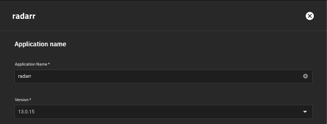

#  TrueNAS Scale

!!! note
	This guide walks you through configuring a Starr-app stack on TrueNAS Scale. Scale is a Debian successor/fork of the FreeBSD-based TrueNAS Core, a NAS operating system. While Scale has quite a few similarities to Core, Scale offers a slightly easier entry for new users, and most importantly for us: Kubernetes and Docker containers. 

	This guide assumes that you've installed TrueNAS Scale, set up a user for yourself, and created a storage pool. The names of your user and pool don't really matter, but you'll have to substitute our example user and pool for your own. For the below examples we'll make our user `trash` and call our pool `tank`.

------ 

## Create a shared group for our apps 

!!! note
	We technically don't have to create separate users for every app; we could use a single user and group for all of them, like Docker tutorials typically recommend. **However** it's best practice and good InfoSec to limit the access for apps and users to what is necessary. This limits the damage those apps and users can do to the rest of the system, in case of attacks or user-error. Having a shared group will also let us access our library with our own user through a network share.

TrueNAS provides us with an `apps` user and group. This is meant to get new users going with a functional setup. But we don't want functional - we want good.  

Navigate to Credentials -> Local Groups and click the blue `Add` button in the top right. The default settings are again fine. Don't worry about `Samba Authentication`, we can enable this for our user later on if we want to access our media through SMB. Name your group what you want, we're using `media` because users belonging to this group will manage our media library.

------

## Create your users

We'll now create the user(s) our apps will run as. It's very similar to creating a group, but we've got a bit more options to go through. Navigate to Credentials->Local Users and click add. We'll first create a regular user that will let us authenticate on an SMB share later on, without giving us full access to **everything**. Fill in a Full name and a username will be generated - you can change this if you want, but we usually make them short and lower-case. Set a memorable password, disable "Create New Primary Group" and select the `media` group as the "Primary Group" - it'll be at the bottom of the list. If you want, you can leave the option enabled which will create a new group with the same name as the username you set; you'll then have to select our `media` group as an auxiliary group instead You can give the user a home directory if you like, but it's fine to leave it as `/nonexistent`. Make sure "Samba Authentication" is checked to let this user connect to a network share later on. 

!!! note
	If you're using a single, shared user and group setup (1000:1000 is commonly used in Docker, but TrueNAS defaults to 3000:3000) you can leave New Primary Group checked. Assuming there's not a group that already exists with GID 3000 it will create that group automatically with the same name as the user.  
 
If you're fine with running all your apps as the same user you can skip ahead to the next section. Otherwise, click Add again. 

Users for apps are slightly different, since they're not meant to ever be logged into, or used by an actual user. They're just there to give our apps the proper privileges with our files. In this example we'll add the user for Radarr, but it's exactly the same for all of the app-users. After setting a name and username, enable the "Disable Password" setting. This will make it so that no-one can log in with this user. Again disable "Create New Primary Group" and select `media` as our primary group. Keep most of the remaining settings: home directory set to `/nonexistent` (The permission don't matter since we're not creating/using a home directory anways), Shell set to `nologin`, and no allowed sudo commands. Finally disable "Samba Authentication" and save the new user. Repeat the process for your download client(s), Sonarr, Lidarr, etc. Apps like Prowlarr and Overseerr that don't handle files don't need their own users, they can use the `apps` user.

## Create the main dataset

!!! warning

	In order to take advantage of hardlinks and atomic moves, we need to use a <u>**SINGLE**</u> dataset with sub-folders. Even if it looks like a regular directory structure to the untrained eye, ZFS considers each dataset a separate filesystem, and as such we can't hardlink across two datasets. 

TrueNAS should already have created a root dataset with the same name as our pool, but we won't be able to mount this to our containers. Head over to the Datasets page, select the dataset with the name of the pool you want to use and click Add `Dataset`.Our example dataset will be called `media`, but the name is really up to personal preference.

We'll be fine to leave the options on their defaults. Video files aren't really compressable so compression will be of only minor use to us, but it won't hurt anything. Press Save to create your dataset. I recommend keeping Case Sensitivity as Sensitive and Share Type as "Generic". The Generic type has some more features than the SMB type, and it will still let us use the dataset for an SMB share later on.

 

Your dataset should now be created, but by default it'll be owned by the `root` user and group. That won't let us or our apps add any files. Select the dataset you just created and click the "Edit" button that belongs to the "Permissions" card. The most important point here is to change the group to our shared group, but I still recommend setting the user to the first user we created. Select the user and group you want to own the dataset and tick the "Apply User" and "Apply Group" checkboxes. Also enable the Write permission for Groupand disable the Execute permission for Other. 

## Folder Structure

We can now start creating the folder structure we want for our Starr apps. The final structure should look like this, just with `media` as our top folder instead of `data`: 

{! include-markdown "../../../includes/hardlinks/docker-tree-full.md" !}

There are three different ways to create the folders: Through an SMB share, through the WebUI Shell (System Settings -> Shell), or through SSH (disabled by default). Seting these up should be well-covered by other online guides and is outside the scope of this guide. Whichever method you use you've gotta make sure the new folders have the same permissions as the dataset. Settings permissions is also covered by other guides, but can also be done by re-setting the permissions for the dataset with the "Apply Permissions Recursively" option enabled. 

## Adding TrueCharts

TrueNAS Scale allows us to launch Docker images directly, and comes pre-configured with a smaller set of apps. These work, but most TrueNAS Scale users (including me) would recommend using the TrueCharts versions of the apps, since they offer greater configurabilty than the default apps, but are easier to set up than running regular Docker images (and feature a better solution for running Docker images called Custom app). TrueCharts has a good guide for adding their catalog to TrueNAS [HERE](https://truecharts.org/manual/SCALE/guides/getting-started/). 

## Installing the Starrs

!!! note
	Configuring the Arrs will be identical for all that manage files. Apps that don't manage files (like Prowlarr or Overseerr) are similar, but can be run with UID and GID `568` and don't need the `/data` volume mounted. We'll use Radarr as our example here. 

Once we've got TrueCharts added and synced, we can find Radarr under the "Available Applications" tab, careful to install the TrueCharts version with a yellow tag, not the blue tag of the default apps. You'll probably want to use the search box at the top instead of scrolling through 100+ apps. 

Each app needs a unique name (all lower-case letters), and it's best to call them someting that includes the name of the app, since it'll simplify the DNS names we'll need later. For Radarr we'll just go with `radarr`. We're able to choose the specific chart version (not Radarr version), but it's best to keep it at the latest version (default) unless you know what you're doing. 

   

If you want (or you're running multiple Radarr instances), you can change the port. We don't need to change any of the settings between the chart version and the port.

Most apps need at least a place to store their config files. TrueChart apps are pre-configured to use what's called PVC (Persistent Volume Claim), which is a special type of storage that Kubernetes (and therefore TrueNAS) uses. It's hidden away from users and is automatically created and managed by the system. To access the files in a PVC, the app needs to be stopped and the PVC mounted to one of your datasets using a third-party tool. For many cases PVC is perfectly fine, since it's just a place to store data most users shouldn't ever touch. If we want to have easy access to the configuration like we'd have in a Docker container, we can change the Type of Storage for the "App Config Storage" under "Storage and Persistence" from PVC to Host path. With Host path we need to point the app to an existing folder on our dataset. The below image shows an example with a Host path configuration for Radarr's config. If you keep PVC you don't need to touch these settings.

Next we'll mount our library folders so that Radarr can do some actual work. Directly below the settings for config storage we find "Additinal App Storage". Click Add, keep the type Host path, navigate the Host path to the dataset you created earlier. For our example, that is `/mnt/tank/media`. Enter `/data` into the mount path below. This will mount all of the media folder into Radarr, equivalent to the /data mount mentioned above. This lets Radarr hardlink our torrents and instantly move our usenet downloads. 

If you've got multiple libraries or you'd like other mount points (like a `/backup` mount for storing Radarr's backups) you can also configure them here.

Our final bit of configuration is setting the right user and group for our app. If you opted for the single user solution, you'd enter UID for the user you created in the runAsUser box and the GID for the group that was automatically created (called the same your username) in the runAsGroup and fsGroup boxes. 

We've created separate users for each app, so will use the specific user for Radarr and our shared group. Since `radarr` was the second user we created, it has the UID 3001 which we'll put in the runAsUser input. These inputs don't accept the username or group name, they'll only accept the ID numbers. For both the runAsGroup and fsGroup we'll use the GID of our shared `media` group, which for us is GID 3000. 

Now we just have to click Save, wait for the Radarr container to go from "deploying" to "deployed", then we can access it at http://server-ip:7878. 

## Connecting containers

At this point Radarr should be running and functioning. But we typically aren't satisfied with just Radarr; we'll need a download client and will probably want Prowlarr or Jackett to provide our indexers. 

Like Docker's default network, Kubernetes has its own inter-container DNS. We can access our containers from an external device with our server's IP and the container's designated port, but the containers can't talk to eachother with this IP. Instead, each container gets an internal domain name other containers can use to talk to it. Again, TrueCharts have written up a really nice guide on how the domain system works, as well as how to find the domain name for each of your containers using Heavyscript. You can find the guide [HERE](https://truecharts.org/manual/SCALE/guides/linking-apps). 

{! include-markdown "../../../includes/support.md" !}
<!--- --8<-- "includes/support.md" -->
